# Omnitable

## Local use

By run `git submodule add git@github.com:noncehq/omnitable.git omnitable` to add omnitable monorepo in you app root dir, pull submodule:

```bash
git submodule init
git submodule update
```

Then add `pnpm-workspace.yaml` in you app root dir, and add below to `pnpm-workspace.yaml`:

```yaml
packages:
  - 'omnitable/packages/*'
```

Add this to your package.json:

```json
{
  "dependencies": {
    "@omnitable/omnitable": "workspace:*"
  }
}
```

## Using

```tsx
import Omnitable from 'omnitable'

import config from '../../config_normal'

const Index = () => {
  return (
    <div className="table_example_wrap">
      <Omnitable {...config}></Omnitable>
    </div>
  )
}

export default Index
```

## 基本概念

Omnitable 由多个“部分”组成：

- View：自定义视图
- Sort：排序项
- Filter：筛选项
- Stat：列统计
- Group：数据分组
- Refresh Button：刷新
- Live Button：定时刷新
- Fields：列配置（哪些列展示以及列顺序）
- Timeline：可交互时间线
- Table：表格
- Pagination：分页器

### 头部

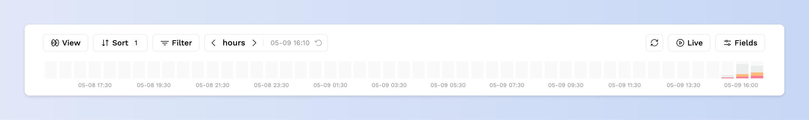

### View

View为自定义视图，自定义视图会保存当前表格的如下字段：

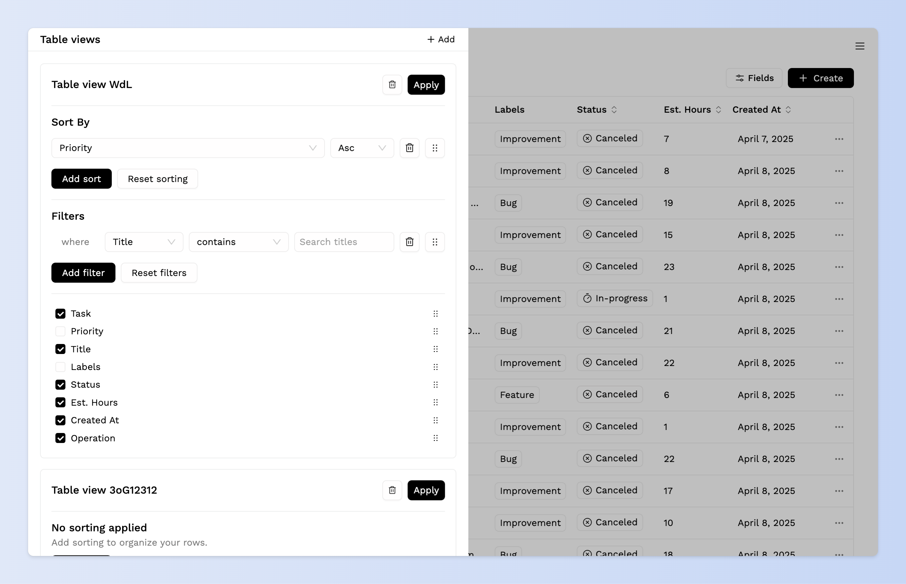

- 排序字段：sort_params
- 筛选关系：filter_relation
- 筛选字段：filter_params
- 统计字段：stat_params
- 分组字段：group_params
- 表格可视字段：visible_columns

### Sort

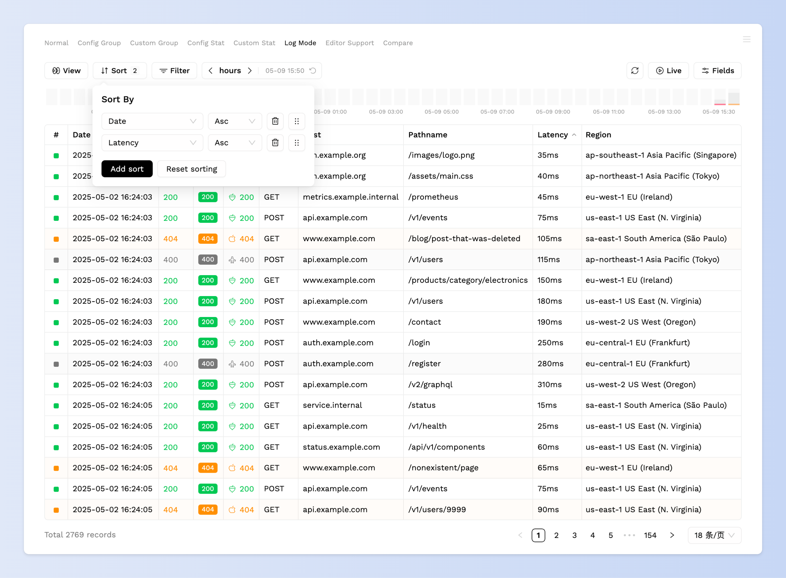

Sort为排序项，通过在配置中指定哪些列的`sort`为`true`即可自动提取为排序项，可在表头上点击添加排序项进行数据查询（asc => desc => null 点击循环），或点开 Sort 排序面板选择字段进行排序。

排序由如下三个影响到查询结果的变量：

- 字段名称：请注意，不是所有类型的字段都可以进行排序，该字段直接作用于数据库，数字类型会进行大小排序，字符类型会进行首字母排序
- 排序规则：`asc`（升序）或`desc`（降序）
- 字段顺序：排序字段会通过api发送到后端，排序字段的顺序将会影响排序的优先级

使用案例

```ts
{
  table: {
    columns: [
      {
        name: '创建时间',
        sort: true,
      },
    ]
  }
}
```

### Filter

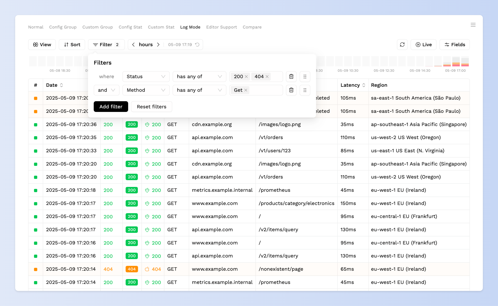

Filter为筛选项，筛选项需要指定数据类型，不同的数据类型对应不同的value组件：

- string，对应input组件
- number，对应input_number组件
- array，对应select组件
- date，对应date_picker或range_picker组件

需要注意的是，使用不同的数据类型，需要保证fields提供对应组件的配置，比如Method在table的column field中被指定为text，但是在filter中被指定为array，那么就需要在fields.filter中覆盖common中的Method定义，将Method字段指定为select组件，如果指定的数据类型和对应的组件不匹配，比如指定为array但对应组件为text，可能会出现无法输入筛选值或者输入后无响应的问题。

### Stat

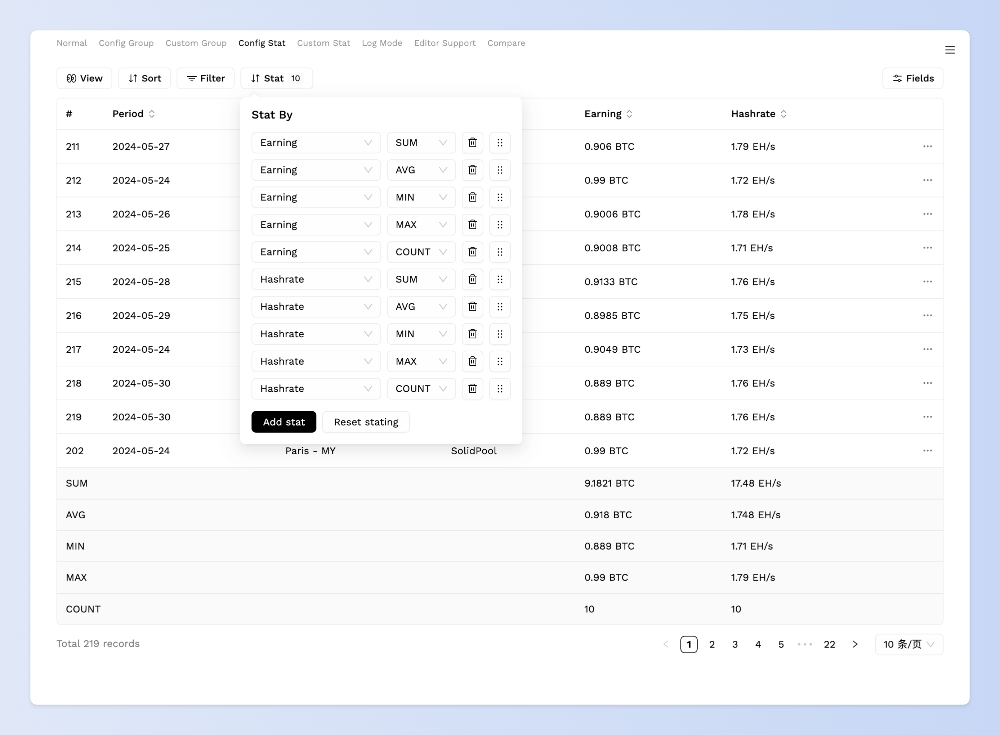

Stat为数据统计配置，支持预先配置和自定义配置：

```ts
{
  header: {
    stat: {
      columns: [
        { name: 'Earning', type: 'SUM' },
        { name: 'Earning', type: 'AVG' },
        { name: 'Earning', type: 'MIN' },
        { name: 'Earning', type: 'MAX' },
        { name: 'Earning', type: 'COUNT' },

        { name: 'Hashrate', type: 'SUM' },
        { name: 'Hashrate', type: 'AVG' },
        { name: 'Hashrate', type: 'MIN' },
        { name: 'Hashrate', type: 'MAX' },
        { name: 'Hashrate', type: 'COUNT' },
      ]
    }
  }
}
```

该配置的计算逻辑在前端，不会涉及到请求。

### Group

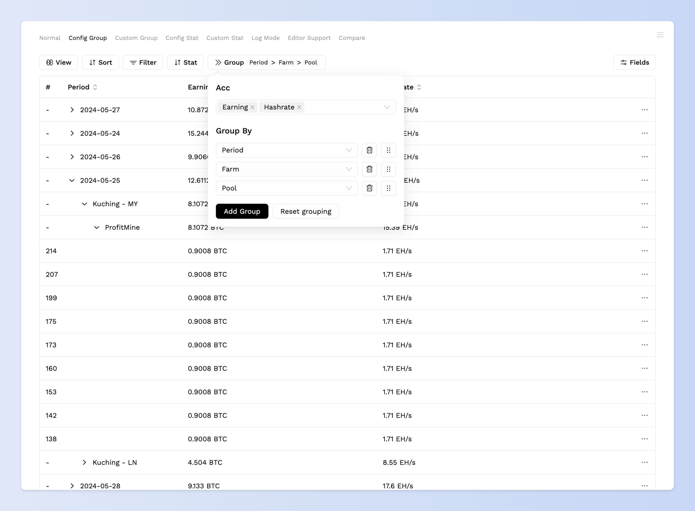

Group为数据分组配置，支持预先配置和自定义配置：

```ts
{
      header: {
            group: {
                  order: 'Period > Farm > Pool',
                  acc: ['Hashrate', 'Earning']
            }
      }
}
```

其中order表示分组层级，acc表示指定哪些字段需要自动累加，该配置的计算逻辑在前端。

### Refresh Button

Refresh Button为刷新按钮，可用来手动刷新数据，配置如下：

```ts
{
  header: {
    refresh: {
      on_show: true
    }
  }
}
```

可通过配置on_show来开启切换到页面自动请求数据。

### Live Button

Live Button为定时刷新按钮，指定数字（单位秒），开启定时刷新。

### Fields

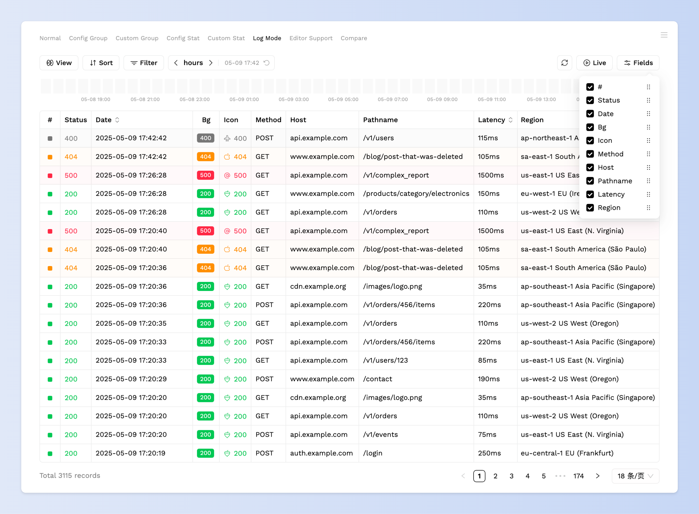

Fields为列配置，可选择展示哪些字段，以及列在table中展示的顺序。

### Timeline

Timeline为时间线，时间线支持三种模式：分钟（三十分钟，间隔为30秒），小时（二十四小时，间隔为30分钟），天（30天，间隔为12小时）：

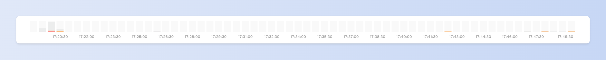
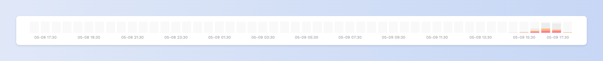
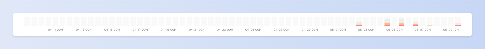

可在头部的时间线控制器上切换模式，以及向前向后切换时间，支持点击柱状图聚焦查询具体时间的数据：

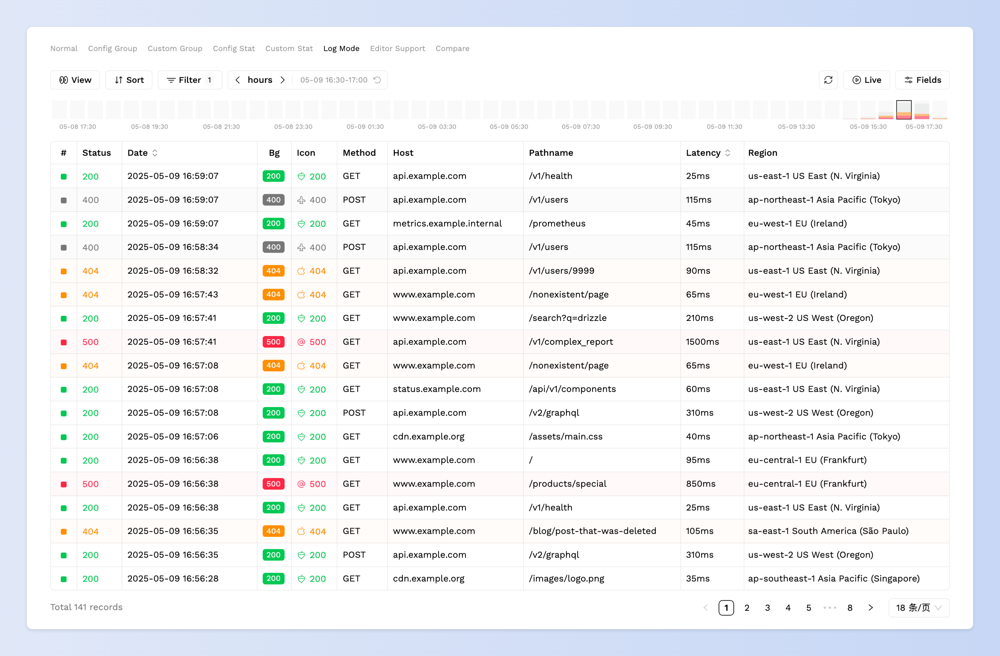

可通过点击时间线控制器上的reset按钮还原到初始状态。

### Table

表格由多个自定义列组成，每个列都可以绑定一个组件，现支持如下组件：

- text：（展示）文本组件
- input：（输入）输入框
- input_number：（输入）数字输入
- textarea：（输入）多段文本输入
- select：（输入）选择框
- tag：（展示）标签
- date：（展示）日期
- date_picker：（输入）日期选择
- range_picker：（输入）日期范围选择
- priority：（输入）优先级选择
- editor：（输入）富文本编辑器
- comments：（输入）评论
- operation：（操作）操作栏

## 配置项类型定义

配置项的 Typescript 类型定义：

```ts
export namespace Omnitable {
  export type Props = LowCodeConfig | Config

  export interface LowCodeConfig {
    config_url: string
  }

  export interface Config {
    /** 外部注入的加载中状态，该字段存在，且为false时触发query */
    locale?: 'en' | 'zh'
    theme?: 'light' | 'dark'
    /** 表名称，用于本地存储的前缀（请保持唯一） */
    name?: string
    adapter?: Adapter
    /** 主键，默认为 'id' */
    primary?: string
    baseurl?: string
    /** 支持mustache语法 /delete/{{id}} => /delete/3 */
    actions?: {
      /** POST */
      query: Action
      /** POST */
      create?: Action
      /** POST */
      update?: Action
      /** POST */
      delete?: Action
    }
    hooks?: {
      /** 处理数据查询到的数据 */
      afterQuery?: (v: any) => any
      /** 处理要创建的数据 */
      beforeCreate?: (v: any) => any
      /** 处理要变更的数据 */
      beforeUpdate?: (v: any) => any
    }
    header?: {
      view?: {}
      sort?: {}
      filter?: {
        columns: Array<FilterColumn>
        defaults?: Model['filter_params']
      }
      stat?: {
        /** 预先配置的字段，指定字段生成数据分析结果 */
        columns?: Array<{ name: string; type: StatType }>
      }
      /** 开启数据分组，支持多层级， */
      group?: {
        /** 预先配置的字段，表示顺序层级，格式为：'Period > Farm > Pool' */
        order?: string
        /** 指定在生成group时，哪些字段的值进行累加 */
        acc?: Array<string>
      }
      /** 显示刷新按钮 */
      refresh?: {
        /** 切换页面时刷新 */
        on_show?: boolean
      }
      /** 开启定时刷新，单位秒 */
      live?: number
      /** 时间线配置 */
      timeline?: {
        api: string
        /** 控制器绑定的查询字段 */
        control_bind: string
        /** 横坐标绑定的变量 */
        label_bind: string
        /** 数据项 */
        items: Array<{ label: string; bind: string; color: PresetColor | string }>
      }
    }
    table: {
      columns: Array<TableColumn>
      /** 是否开启表头滚动固定 */
      table_header_sticky_top?: number
      border?: boolean
      /** 点击row展开详情 */
      row_click?: boolean
      /** 根据某个字段的值改变row的背景色 */
      row_bg?: {
        bind: string
        options: Record<string, PresetColor | string>
      }
      delete_tips?: { title?: string; content?: string }
    }
    /** 可选 form，如果不写就使用 table 的 columns 配置 */
    form?: {
      /** columns中 的字段会覆盖 bind 相同的 table_columns 中的字段 */
      columns?: Array<FormColumn>
      /** 弹窗形式，drawer 为抽屉弹窗，modal为模态框 */
      dialog?: 'drawer' | 'modal'
      /** dialog 为 drawer 时生效 */
      drawer?: Pick<IPropsDrawer, 'className' | 'width' | 'header'>
      /** dialog 为 modal 时生效 */
      modal?: Pick<IPropsModal, 'className' | 'width' | 'height' | 'header'>
      /** 在table_columns的基础上扩展列 */
      use_table_columns?: boolean
      exclude_table_columns?: Array<string>
      /**
       * 自定义渲染内容，fields 通过 column name 可引用对应的字段组件
       * @param fields - 字段组件的集合，key 为 column 的 name，value 为对应的 ReactNode
       * @param item - 当前行的数据项
       */
      render?: (
        fields: Record<string, ReactNode>,
        item: any,
        options: { type: Model['modal_type']; save: ReactNode; close: ReactNode; onClose: () => void },
      ) => ReactNode
    }
    /** 字段对应的组件 */
    fields: {
      /** filter和table可覆盖common中定义的字段 */
      common?: Fields
      filter?: Fields
      table?: Fields
      form?: Fields
    }
    /** 分页器 */
    pagination?: {
      pagesize?: number
    }
    /** 使用外部数据 */
    external_data?: Error | { data: Omnitable.List }
    /** 加载中状态 */
    suspending?: boolean
    /** 注册自定义 fields 组件 */
    register_fields?: Record<string, RegisterFieldValue | FC<any>>
  }

  export interface RegisterFieldValue {
    Component: FC<any>
    readonly?: boolean
  }

  export interface AdapterQueryArgs {
    config: Omnitable.Config
    sort_params: Model['sort_params']
    filter_relation: Model['filter_relation']
    filter_params: Model['filter_params']
    page: Model['pagination']['page']
    pagesize: Model['pagination']['pagesize']
  }

  /** 适配器 */
  export interface Adapter {
    query: (args: AdapterQueryArgs) => Promise<Omnitable.Error | { data: Omnitable.List }>
  }

  export type Action =
    | string
    | {
        api: string
        params: Record<string, any>
      }

  export interface BaseColumn {
    name: string
    width?: number
    /** form 24栅格，span表示跨度 */
    span?: number
  }

  export interface FilterColumn extends BaseColumn {
    datatype: 'string' | 'number' | 'array' | 'date' | 'priority'
    // 指定组件类型
    forcetype?: string
  }

  export interface TableColumn extends BaseColumn {
    desc?: string
    sort?: boolean | 'asc' | 'desc'
    readonly?: boolean
    sticky?: boolean
    align?: CSSProperties['textAlign']
    use_item?: boolean
  }

  export interface FormColumn extends BaseColumn {
    readonly?: boolean
  }

  export interface Fields {
    [key: string]: Field
  }

  export type Field = { bind: string } & FieldComponent

  export type FieldComponent =
    | Index
    | Text
    | Input
    | InputNumber
    | Textarea
    | Select
    | Tag
    | Date
    | DatePicker
    | RangePicker
    | Priority
    | Editor
    | Comments
    | Operation
    | RegisterField

  export type Index = {
    type: 'index'
    props?: {}
  }

  export type Text = {
    type: 'text'
    props?: {
      /** 开启format的情况下，会传入整个item作为参数 */
      format?: string
      /** "({{value}})" */
      textwrap?: string
      /** 使用了上面其中一种格式化后prefix和suffix会失效 */
      prefix?: string
      suffix?: string
    }
  }

  export type Input = {
    type: 'input'
    props?: InputProps
  }

  export type InputNumber = {
    type: 'input_number'
    props?: InputNumberProps
  }

  export type Textarea = {
    type: 'textarea'
    props?: TextAreaProps
  }

  export type Select = {
    type: 'select'
    props: {
      options?: Array<SelectOption>
      /** 如果设置remote，则忽略options，使用remote请求options */
      remote?: {
        /** 如果未设置search，则使用api获取options */
        api: string
        /** 开启关键词搜索options，值为查询key名称 */
        search?: string
        /** 值为根据value查询的id的key */
        id?: string
        /** 附带的请求参数 */
        query?: Record<string, any>
      }
      single?: boolean
      mode?: 'multiple' | 'tags'
      placeholder?: string
      borderless?: boolean
      allowClear?: boolean
      labelInValue?: boolean
    }
  }

  export interface SelectOption {
    label: ReactNode
    value: string | number | boolean
    icon?: string
  }

  export interface Tag {
    type: 'tag'
    props: {
      options: Array<TagOption>
      mode?: 'dot' | 'text' | 'full'
      dot_shape?: 'circle' | 'round'
      dot_size?: number
      icon_size?: number | string
      icon_position?: 'left' | 'right'
      use_bg?: boolean
      center?: boolean
      prefix?: string
      suffix?: string
    }
  }

  export interface TagOption {
    label?: ReactNode
    value: string | number | boolean | '__self__'
    color: PresetColor | string | ((v: TagOption['value']) => PresetColor | string)
    icon?: ReactNode | ((v: TagOption['value']) => ReactNode)
  }

  export type Date = {
    type: 'date'
    props?: {
      format?: string
    }
  }

  export type DatePicker = {
    type: 'date_picker'
    props?: {
      format?: string
    }
  }

  export type RangePicker = {
    type: 'range_picker'
    props?: {
      format?: string | [string, string]
    }
  }

  export type Priority = {
    type: 'priority'
    props?: {
      options?: [undefined | string | number, string | number, string | number, string | number, string | number]
      placeholder?: string
      borderless?: boolean
    }
  }

  export type Editor = {
    type: 'editor'
    props?: {
      max_height?: number
      uploadImage?: () => Promise<string | undefined>
    }
  }

  export type Comments = {
    type: 'comments'
    props: {
      /** 数据绑定的key */
      binds: {
        date: string
        text: string
        role?: string
      }
    }
  }

  export type Operation = {
    type: 'operation'
    props?: {
      no_edit?: boolean
      no_delete?: boolean
    }
  }

  export type RegisterField = {
    type: 'register'
    field: string
    props?: any
  }

  export type PresetColor = 'light' | 'dark' | 'danger' | 'success' | 'warning'

  export interface Error {
    error: any
    message?: string
  }

  export type MutationResponse = Error | { id: number }

  export interface List {
    items: Array<any>
    total?: number
    page?: number
    pagesize?: number
  }
}
```

## Attention

Using omnitable in Next.js, you should add `"use client"` on top of file.
